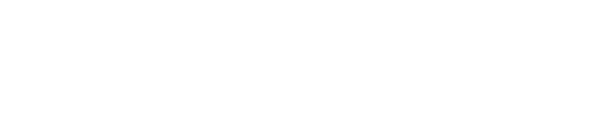

<div align="center">
  
</div>

# AGLA-Core: The Next-Generation RAG Framework

**AGLA-Core (Adaptive Graph-Lite Architecture) is a production-grade, open-source framework for building advanced Retrieval-Augmented Generation (RAG) applications that are fast, accurate, and context-aware.**

---

## The Vision: Beyond Simple RAG

Traditional RAG systems are powerful but often hit a wall with complex, multi-hop questions. They treat documents as isolated data points, missing the rich web of connections between them. AGLA-Core solves this by integrating a graph-based approach, allowing it to reason about relationships and deliver insights that simple vector search cannot.

We built AGLA-Core for developers who need to:
- **Answer complex questions** that require synthesizing information from multiple sources.
- **Eliminate hallucinations** by providing transparent, traceable reasoning paths.
- **Build scalable, enterprise-ready AI systems** on a modern, containerized stack.

## Key Features

- **Hybrid Retrieval:** Combines the speed of **Quantized Vector Search** (Qdrant) for semantic similarity with the precision of **Graph Traversal** (FalkorDB) for relationship-based queries.
- **Agentic Routing:** Intelligently routes user queries to the best retrieval strategy (e.g., factual lookup vs. complex graph traversal) using a powerful **LangGraph**-based orchestrator.
- **Reasoning Visualization:** The Next.js frontend doesn't just give you an answer; it shows you the **"Reasoning Path"** the agent took, building trust and transparency.
- **Production-Ready Stack:** Fully containerized with Docker Compose, featuring a FastAPI backend, a sleek Next.js 14 frontend, and best-in-class databases.
- **Binary Quantization:** Delivers blazing-fast vector search with a smaller memory footprint, without sacrificing accuracy.

## Architecture Deep-Dive

AGLA-Core is built on a modular, microservices-oriented architecture:

1.  **Frontend (Next.js 14):** A sleek, glassmorphism-style UI that provides a rich, interactive chat experience and visualizes the agent's reasoning process.
2.  **Backend (FastAPI):** A high-performance Python API server that handles user queries and orchestrates the RAG pipeline.
3.  **Orchestrator (LangGraph):** The "brain" of the system. It analyzes incoming queries and directs traffic between the vector and graph databases.
4.  **Vector DB (Qdrant):** Stores high-dimensional document embeddings for fast semantic search, optimized with binary quantization.
5.  **Graph DB (FalkorDB):** Stores entities and their relationships, enabling deep, contextual exploration of the knowledge base.

```
[User Query] -> [Next.js Frontend] -> [FastAPI Backend] -> [LangGraph Orchestrator]
                                                                  |
                                     +----------------------------+----------------------------+
                                     | (Semantic Similarity)      | (Complex Relationships)    |
                                     v                            v                            v
                               [Qdrant Vector DB]           [FalkorDB Graph]             [Vector & Graph]
                                     |                            |                            |
                                     +----------------------------+----------------------------+
                                                                  |
                                     v
                               [LLM for Synthesis] -> [Final Answer with Reasoning Path]
```

## Getting Started

### Prerequisites
- Docker & Docker Compose
- An OpenAI API Key

### Quickstart

1.  **Clone the Repository:**
    ```bash
    git clone https://github.com/your-username/agla-core.git
    cd agla-core
    ```

2.  **Configure Environment:**
    Create a `.env` file from the existing `README.md` and add your OpenAI API key:
    ```bash
    echo "OPENAI_API_KEY=sk-..." > .env
    ```

3.  **Launch the Stack:**
    ```bash
    docker-compose up --build
    ```

4.  **Explore:**
    - **Frontend Application:** `http://localhost:3000`
    - **Backend API Docs:** `http://localhost:8000/docs`

## Project Roadmap

- [ ] **Advanced Data Ingestion:** Connectors for Notion, Slack, and other common data sources.
- [ ] **Multi-Modal Support:** Ability to process and query images and other media types.
- [ ] **Helm Charts:** For easy deployment to Kubernetes clusters.
- [ ] **Evaluation Engine:** A suite of tools for rigorously testing retrieval and generation quality.

## Contributing

We welcome contributions from the community! Please see our `CONTRIBUTING.md` file for guidelines on how to get involved.

---

**Built by TacticDev.**
